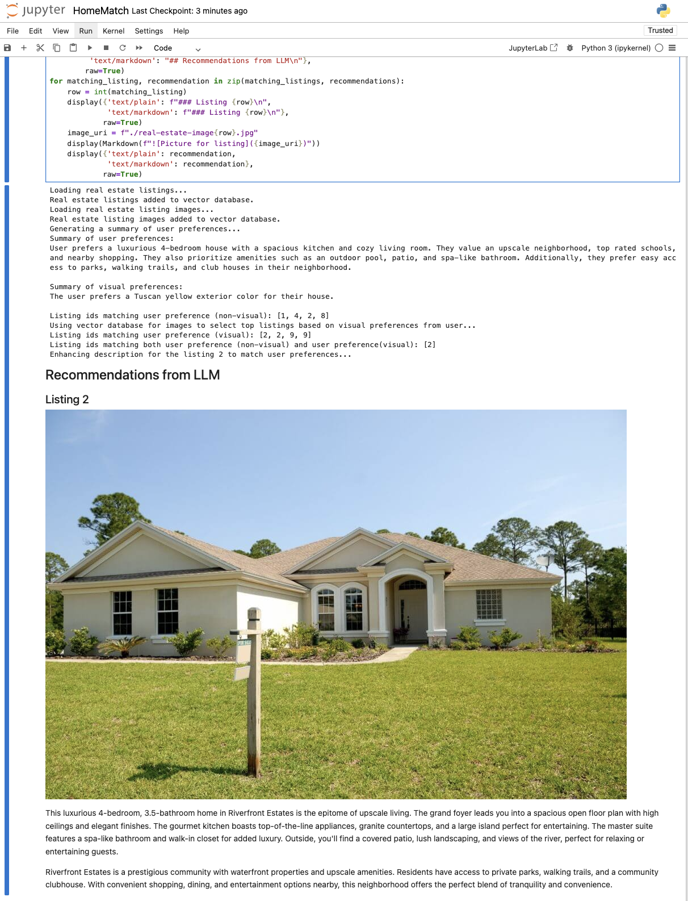

### Overview

This is a demo implementation of an LLM based Real-estate agent, 
which recommends a house from available real estate listings and images 
based on user preferences.

Recommendation is based on non-visual user preferences (such as the
size of the house, amenities, neighborhood characteristics, etc). 
In multi-modal mode (enabled by default), recommendation also takes 
into account visual preferences (color of the house) to further filter
recommendations. Note that non-visual user preferences take precedence,
if there are no common results for non-visual and visual preferences.

### How to run the application?

**Minimum requirement:** Python 3.

Implementation is available as jupyter notebook (see *HomeMatch.ipynb*). So,
if you have jupyter notebook installed locally, or on a server, you
can directly run cells in HomeMatch.ipynb.

As a fallback, there is a python file (*HomeMatch.py*) with the same code 
that can be run from an IDE (like pycharm) or directly from terminal 
using a python interpreter. 

The only difference between the two ways of running is that notebook 
supports markdown syntax (including embedding images in the markdown syntax), 
while running the python file will output in plain text, and display images
in separate windows.

The dependencies are included in *requirements.txt* file. You will be able
to install these dependencies (e.g., using pip/pip3) in your virtual
environment before being able to run this code.

Before running the code, make sure you have added your OpenAI key in the \
following line in the source code:

```python
os.environ["OPENAI_API_KEY"] = "<Your-OpenAI-Key>"
```

### Default mode

By default, the application uses pre-generated real estate listings 
(see *generated-real-estate-listings.csv*), and 
is run in multi-modal mode (i.e. uses both non-visual and visual user preference
to make recommendations).

1. Loads real estate listings from CSV file (using LangChain's CSVLoader component).
2. Loads the listings into a vector database (using ChromaDB), with sequential ids.
3. Loads images into another vector database (using LanceDB), with sequential ids.
4. Uses pre-populated list of question/answer pairs related to non-visual preferences.
5. Uses pre-populated list of question/answer pairs related to visual preferences.
6. Summarizes non-visual and visual preferences using LLM.
7. Performs semantic search for matching listings based on non-visual preferences (using the ChromaDB vector db initialized above).
8. Performs semantic search for matching listings based on visual preferences (using the LanceDB vector db initialized above).
9. Computes intersection of listing ids for the above semantic searches. If there is at least one intersection, computed intersection is used, otherwise we fallback to using non-visual search results.
10. Uses LLM to enhance the real estate listing description for the matches to appeal to user preferences. Only factual information that was available from the original listing is included.
11. Displays recommended listings (along with images) in markdown synatx.

### Non-default modes

You can change *regenerate_listings* variable to true in the source code to generate real estate listings from scratch using an LLM.
This will overwrite *generated-real-estate-listings.csv* file

```python
regenerate_listings = True
```

You can change *multi_modal_mode* variable to false in the source code to turn off recommendations based on visual preferences.
Multi-modal mode can take slightly longer to run (several minutes), so this option is useful if you only want to see 
recommendations based on non-visual preferences.

```python
multi_modal_mode = False
```

### Sample run

Sample run for default mode (attached image file `RealEstateAgent-Demo-Screenshot.png`)



### FAQs

* ChromaDB fails with the error `attempt to write a readonly database` on jupyter notebooks, if
the locally generated `chroma` directory or its contents or deleted. In such cases, restart jupyter
notebook.
* The default mode has multi-modal mode enabled, which can take somewhat long (several minutes) for loading
image embeddings in vector db. If this is too long, you can turn off multi-modal mode by changing `multi_modal_mode`
to false in source code.

### References

* Vector Databases
  * https://lancedb.com/
  * https://www.trychroma.com/
* LLMs
  * https://openai.com/
* LangChain: https://www.langchain.com/
* Generative AI course from Udacity: https://www.udacity.com/course/generative-ai--nd608
